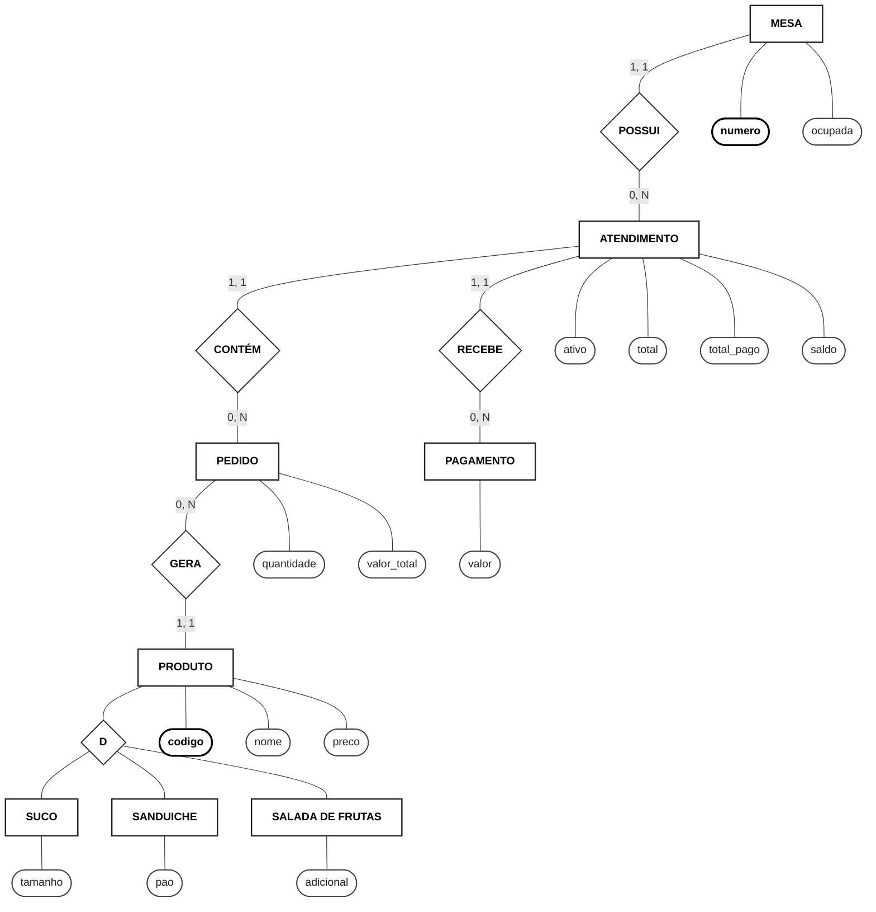

```mermaid
flowchart TB
    %% --- ESTILIZAÇÃO VISUAL (PADRÃO DRAW.IO / CHEN) ---
    classDef entidade fill:#ffffff,stroke:#222222,stroke-width:2px,color:#000000,font-weight:bold;
    classDef atributo fill:#ffffff,stroke:#444444,stroke-width:1.5px,color:#222222;
    classDef atributoPK fill:#ffffff,stroke:#000000,stroke-width:2.5px,color:#000000,font-weight:bold;
    classDef relacao fill:#ffffff,stroke:#222222,stroke-width:1.5px,color:#000000,font-weight:bold;
    classDef disjuncao fill:#ffffff,stroke:#222222,stroke-width:1.5px,color:#000000,font-weight:bold;

    %% --- ENTIDADES (RETÂNGULOS) ---
    MESA[MESA]:::entidade
    ATENDIMENTO[ATENDIMENTO]:::entidade
    PEDIDO[PEDIDO]:::entidade
    PAGAMENTO[PAGAMENTO]:::entidade
    PRODUTO[PRODUTO]:::entidade
    SUCO[SUCO]:::entidade
    SANDUICHE[SANDUICHE]:::entidade
    SALADA[SALADA DE FRUTAS]:::entidade

    %% --- RELACIONAMENTOS (LOSANGOS) ---
    R_POSSUI{ POSSUI }:::relacao
    R_CONTEM{ CONTÉM }:::relacao
    R_RECEBE{ RECEBE }:::relacao
    R_GERA{ GERA }:::relacao
    D{ D }:::disjuncao

    %% --- ATRIBUTOS DA MESA ---
    A_m_num([numero]):::atributoPK
    A_m_ocup([ocupada]):::atributo

    MESA --- A_m_num
    MESA --- A_m_ocup

    %% --- ATRIBUTOS DO ATENDIMENTO ---
    A_at_ativo([ativo]):::atributo
    A_at_tot([total]):::atributo
    A_at_pago([total_pago]):::atributo
    A_at_saldo([saldo]):::atributo

    ATENDIMENTO --- A_at_ativo
    ATENDIMENTO --- A_at_tot
    ATENDIMENTO --- A_at_pago
    ATENDIMENTO --- A_at_saldo

    %% --- ATRIBUTOS DO PEDIDO ---
    A_ped_qtd([quantidade]):::atributo
    A_ped_sub([valor_total]):::atributo

    PEDIDO --- A_ped_qtd
    PEDIDO --- A_ped_sub

    %% --- ATRIBUTOS DO PAGAMENTO ---
    A_pag_val([valor]):::atributo

    PAGAMENTO --- A_pag_val

    %% --- ATRIBUTOS DO PRODUTO E SUBCLASSES ---
    A_pr_cod([codigo]):::atributoPK
    A_pr_nom([nome]):::atributo
    A_pr_pre([preco]):::atributo

    PRODUTO --- A_pr_cod
    PRODUTO --- A_pr_nom
    PRODUTO --- A_pr_pre

    A_s_tam([tamanho]):::atributo
    SUCO --- A_s_tam

    A_sa_pao([pao]):::atributo
    SANDUICHE --- A_sa_pao

    A_sf_adi([adicional]):::atributo
    SALADA --- A_sf_adi

    %% --- LIGAÇÕES DE CARDINALIDADE ---
    MESA ---|1, 1| R_POSSUI
    R_POSSUI ---|0, N| ATENDIMENTO

    ATENDIMENTO ---|1, 1| R_CONTEM
    R_CONTEM ---|0, N| PEDIDO

    ATENDIMENTO ---|1, 1| R_RECEBE
    R_RECEBE ---|0, N| PAGAMENTO

    PEDIDO ---|0, N| R_GERA
    R_GERA ---|1, 1| PRODUTO

    %% --- HERANÇA / ESPECIALIZAÇÃO (D) ---
    PRODUTO --- D
    D --- SUCO
    D --- SANDUICHE
    D --- SALADA
```
