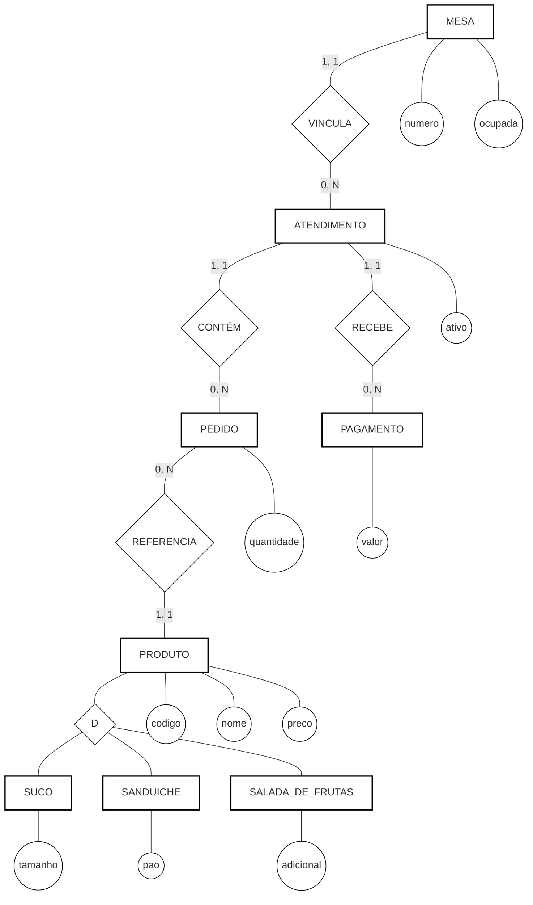

```mermaid
graph TD
    %% --- ESTILOS DE NÓS (NOTAÇÃO DE CHEN) ---
    classDef entidade fill:#ffffff,stroke:#000000,stroke-width:2px;
    classDef atributo fill:#ffffff,stroke:#000000,stroke-width:1px;
    classDef relacao fill:#ffffff,stroke:#000000,stroke-width:1px;

    %% --- ENTIDADES (RETÂNGULOS) ---
    MESA[MESA]:::entidade
    ATENDIMENTO[ATENDIMENTO]:::entidade
    PEDIDO[PEDIDO]:::entidade
    PAGAMENTO[PAGAMENTO]:::entidade
    PRODUTO[PRODUTO]:::entidade
    SUCO[SUCO]:::entidade
    SANDUICHE[SANDUICHE]:::entidade
    SALADA[SALADA_DE_FRUTAS]:::entidade

    %% --- RELACIONAMENTOS (LOSANGOS) ---
    R_POSSUI{VINCULA}:::relacao
    R_CONTEM{CONTÉM}:::relacao
    R_RECEBE{RECEBE}:::relacao
    R_REFERENCIA{REFERENCIA}:::relacao
    D{D}:::relacao

    %% --- ATRIBUTOS (ÓVALOS) ---
    A_m1((numero)):::atributo
    A_m2((ocupada)):::atributo

    A_at1((ativo)):::atributo

    A_p1((quantidade)):::atributo

    A_pag1((valor)):::atributo

    A_prod1((codigo)):::atributo
    A_prod2((nome)):::atributo
    A_prod3((preco)):::atributo

    A_s1((tamanho)):::atributo
    A_sa1((pao)):::atributo
    A_sf1((adicional)):::atributo

    %% --- LIGAÇÕES DOS ATRIBUTOS ---
    MESA --- A_m1
    MESA --- A_m2

    ATENDIMENTO --- A_at1

    PEDIDO --- A_p1

    PAGAMENTO --- A_pag1

    PRODUTO --- A_prod1
    PRODUTO --- A_prod2
    PRODUTO --- A_prod3

    SUCO --- A_s1
    SANDUICHE --- A_sa1
    SALADA --- A_sf1

    %% --- RELACIONAMENTOS E CARDINALIDADES ---
    MESA ---|1, 1| R_POSSUI
    R_POSSUI ---|0, N| ATENDIMENTO

    ATENDIMENTO ---|1, 1| R_CONTEM
    R_CONTEM ---|0, N| PEDIDO

    ATENDIMENTO ---|1, 1| R_RECEBE
    R_RECEBE ---|0, N| PAGAMENTO

    PEDIDO ---|0, N| R_REFERENCIA
    R_REFERENCIA ---|1, 1| PRODUTO

    %% --- ESPECIALIZAÇÃO / HERANÇA (D) ---
    PRODUTO --- D
    D --- SUCO
    D --- SANDUICHE
    D --- SALADA
```
