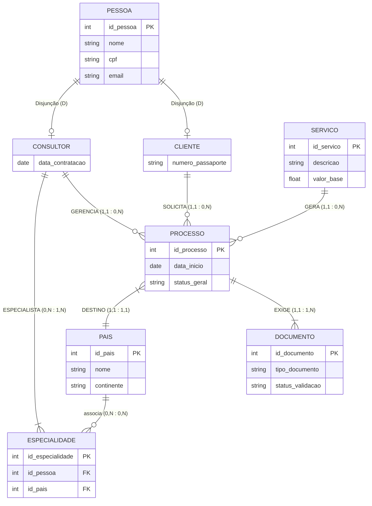

```mermaid
erDiagram
    %% --- ENTIDADES E ATRIBUTOS ---
    PESSOA {
        int id_pessoa PK
        string nome
        string cpf
        string email
    }

    CLIENTE {
        string numero_passaporte
    }

    CONSULTOR {
        date data_contratacao
    }

    SERVICO {
        int id_servico PK
        string descricao
        float valor_base
    }

    PROCESSO {
        int id_processo PK
        date data_inicio
        string status_geral
    }

    DOCUMENTO {
        int id_documento PK
        string tipo_documento
        string status_validacao
    }

    PAIS {
        int id_pais PK
        string nome
        string continente
    }

    ESPECIALIDADE {
        int id_especialidade PK
        int id_pessoa FK
        int id_pais FK
    }

    %% --- HERANÇA / ESPECIALIZAÇÃO (D) ---
    PESSOA ||--o| CLIENTE : "Disjunção (D)"
    PESSOA ||--o| CONSULTOR : "Disjunção (D)"

    %% --- RELACIONAMENTOS E CARDINALIDADES ---
    CLIENTE ||--o{ PROCESSO : "SOLICITA (1,1 : 0,N)"
    SERVICO ||--o{ PROCESSO : "GERA (1,1 : 0,N)"
    CONSULTOR ||--o{ PROCESSO : "GERENCIA (1,1 : 0,N)"
    PROCESSO ||--|{ DOCUMENTO : "EXIGE (1,1 : 1,N)"
    PROCESSO }|--|| PAIS : "DESTINO (1,1 : 1,1)"
    CONSULTOR ||--|{ ESPECIALIDADE : "ESPECIALISTA (0,N : 1,N)"
    PAIS ||--o{ ESPECIALIDADE : "associa (0,N : 0,N)"
```
